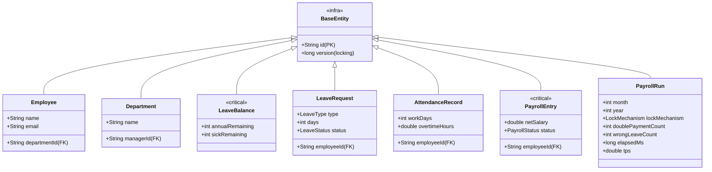

# Báo cáo Thiết Kế Kiến Trúc & Cấu trúc Dữ Liệu
**Project:** Employee Payroll Management Simulation (LAB211)

---

## 1. Class Diagram Tổng Quan (Mô hình MVC - Phần MODEL)
Tất cả các mô hình dữ liệu chính yếu (Entity) đều được kế thừa từ `BaseEntity` để chia sẻ khóa chính dạng chuỗi (`id`) và thuộc tính `version` (kiểu long) dùng làm nền tảng cho cơ chế **Optimistic Locking** ngăn ngừa race condition.

---

## 2. Schema Thực tế tại 7 File CSV

Tổng quan dữ liệu được tự động sinh ngẫu nhiên tuân thủ tuyệt đối quy tắc của lược đồ lớp trên. 

| Tên File | Thuộc tính (Cột) | Kiểu Dữ Liệu Tương Ứng | Ghi chú (Khóa Ngoại / Vai trò) |
| --- | --- | --- | --- |
| **`departments.csv`** | `id` `version` `name` `managerId` | String (Ví dụ: `D001`) long (Luôn = 1) String String |  Cột locking.  **FK** trỏ tới `id` trong `employees.csv` |
| **`employees.csv`** | `id` `version` `name` `email` `departmentId` | String (Ví dụ: `E0001`) long String String String |     **FK** trỏ tới `id` trong `departments.csv` |
| **`leave_balances.csv`** | `id` `version` `annualRemaining` `sickRemaining` | String (Dùng chung Employee ID) long int int |  ⚡ Cực kỳ quan trọng để test **Wrong Leave Deduction**. (Trừ phép xong version tăng lên 1) |
| **`leave_requests.csv`** | `id` `version` `employeeId` `type` `days` `status` | String (Ví dụ: LR_...) long String Enum *(ANNUAL/SICK)* int Enum *(PENDING/APPROVED/REJECTED)* |   **FK** trỏ tới `id` trong Employee.    |
| **`attendance.csv`** | `id` `version` `employeeId` `workDays` `overtimeHours` | String (Ví dụ: A_...) long String int double |   **FK** trỏ tới `id` trong Employee.   *Note: Bản ghi được tổng hợp theo tháng.* |
| **`payroll_entries.csv`** | `id` `version` `employeeId` `netSalary` `status` | String (Ví dụ: PR_...) long String double Enum *(PENDING/PROCESSED)* |  ⚡ Cực kỳ quan trọng để test **Double Payment**. **FK** trỏ tới `id` Employee.  (Thread xử lý xong sửa PENDING thành PROCESSED) |
| **`payroll_runs.csv`** | `id` `version` `month` `year` `lockMechanism` `doublePaymentCount` `wrongLeaveCount` `elapsedMs` `tps` | String (VD: RUN_NONE_...) long int int Enum *(OPTIMISTIC/QUEUE/...)* int int long double | Lưu trữ output kết quả cho báo cáo phân tích hiệu năng của Simulator. Đặc biệt là thông số count xem thuật toán nào bỏ lọt lỗi. |

---

## 3. Quá Trình Build File Dữ Liệu
Tool đã được cài đặt thuật toán để sinh dữ liệu chéo nhau theo nguyên tắc:
- Tổng số nhân viên (`NUM_EMPLOYEES`): 1,200 người.
- Tổng giả lập: **12 Tháng**.
- Điều này giúp file báo cáo `attendance.csv` và `payroll_entries.csv` đạt ngưỡng **14,400 Records mỗi file**, vượt mức yêu cầu >= 10.000 dòng.
