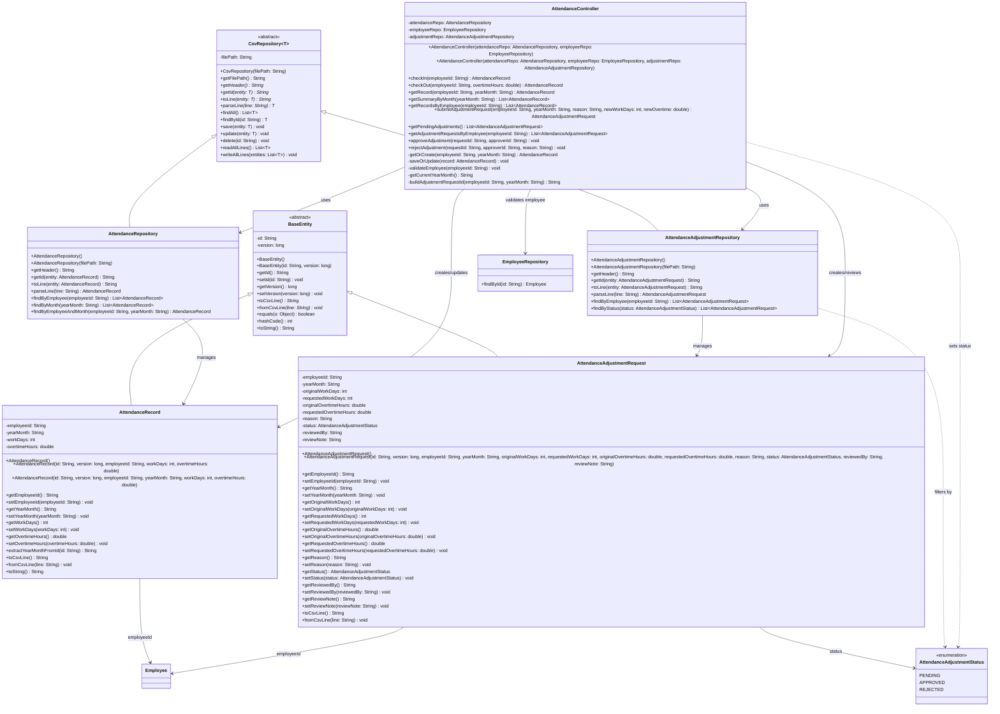

```mermaid
classDiagram
    class BaseEntity {
        <<abstract>>
        -id: String
        -version: long
        +BaseEntity()
        +BaseEntity(id: String, version: long)
        +getId() String
        +setId(id: String) void
        +getVersion() long
        +setVersion(version: long) void
        +toCsvLine() String*
        +fromCsvLine(line: String) void*
        +equals(o: Object) boolean
        +hashCode() int
        +toString() String
    }

    class CsvRepository~T~ {
        <<abstract>>
        -filePath: String
        +CsvRepository(filePath: String)
        +getFilePath() String
        +getHeader() String*
        +getId(entity: T) String*
        +toLine(entity: T) String*
        +parseLine(line: String) T*
        +findAll() List~T~
        +findById(id: String) T
        +save(entity: T) void
        +update(entity: T) void
        +delete(id: String) void
        +readAllLines() List~T~
        +writeAllLines(entities: List~T~) void
    }

    class AttendanceRecord {
        -employeeId: String
        -yearMonth: String
        -workDays: int
        -overtimeHours: double
        +AttendanceRecord()
        +AttendanceRecord(id: String, version: long, employeeId: String, workDays: int, overtimeHours: double)
        +AttendanceRecord(id: String, version: long, employeeId: String, yearMonth: String, workDays: int, overtimeHours: double)
        +getEmployeeId() String
        +setEmployeeId(employeeId: String) void
        +getYearMonth() String
        +setYearMonth(yearMonth: String) void
        +getWorkDays() int
        +setWorkDays(workDays: int) void
        +getOvertimeHours() double
        +setOvertimeHours(overtimeHours: double) void
        +extractYearMonthFromId(id: String) String
        +toCsvLine() String
        +fromCsvLine(line: String) void
        +toString() String
    }

    class AttendanceAdjustmentRequest {
        -employeeId: String
        -yearMonth: String
        -originalWorkDays: int
        -requestedWorkDays: int
        -originalOvertimeHours: double
        -requestedOvertimeHours: double
        -reason: String
        -status: AttendanceAdjustmentStatus
        -reviewedBy: String
        -reviewNote: String
        +AttendanceAdjustmentRequest()
        +AttendanceAdjustmentRequest(id: String, version: long, employeeId: String, yearMonth: String, originalWorkDays: int, requestedWorkDays: int, originalOvertimeHours: double, requestedOvertimeHours: double, reason: String, status: AttendanceAdjustmentStatus, reviewedBy: String, reviewNote: String)
        +getEmployeeId() String
        +setEmployeeId(employeeId: String) void
        +getYearMonth() String
        +setYearMonth(yearMonth: String) void
        +getOriginalWorkDays() int
        +setOriginalWorkDays(originalWorkDays: int) void
        +getRequestedWorkDays() int
        +setRequestedWorkDays(requestedWorkDays: int) void
        +getOriginalOvertimeHours() double
        +setOriginalOvertimeHours(originalOvertimeHours: double) void
        +getRequestedOvertimeHours() double
        +setRequestedOvertimeHours(requestedOvertimeHours: double) void
        +getReason() String
        +setReason(reason: String) void
        +getStatus() AttendanceAdjustmentStatus
        +setStatus(status: AttendanceAdjustmentStatus) void
        +getReviewedBy() String
        +setReviewedBy(reviewedBy: String) void
        +getReviewNote() String
        +setReviewNote(reviewNote: String) void
        +toCsvLine() String
        +fromCsvLine(line: String) void
    }

    class AttendanceAdjustmentStatus {
        <<enumeration>>
        PENDING
        APPROVED
        REJECTED
    }

    class AttendanceRepository {
        +AttendanceRepository()
        +AttendanceRepository(filePath: String)
        +getHeader() String
        +getId(entity: AttendanceRecord) String
        +toLine(entity: AttendanceRecord) String
        +parseLine(line: String) AttendanceRecord
        +findByEmployee(employeeId: String) List~AttendanceRecord~
        +findByMonth(yearMonth: String) List~AttendanceRecord~
        +findByEmployeeAndMonth(employeeId: String, yearMonth: String) AttendanceRecord
    }

    class AttendanceAdjustmentRepository {
        +AttendanceAdjustmentRepository()
        +AttendanceAdjustmentRepository(filePath: String)
        +getHeader() String
        +getId(entity: AttendanceAdjustmentRequest) String
        +toLine(entity: AttendanceAdjustmentRequest) String
        +parseLine(line: String) AttendanceAdjustmentRequest
        +findByEmployee(employeeId: String) List~AttendanceAdjustmentRequest~
        +findByStatus(status: AttendanceAdjustmentStatus) List~AttendanceAdjustmentRequest~
    }

    class AttendanceController {
        -attendanceRepo: AttendanceRepository
        -employeeRepo: EmployeeRepository
        -adjustmentRepo: AttendanceAdjustmentRepository
        +AttendanceController(attendanceRepo: AttendanceRepository, employeeRepo: EmployeeRepository)
        +AttendanceController(attendanceRepo: AttendanceRepository, employeeRepo: EmployeeRepository, adjustmentRepo: AttendanceAdjustmentRepository)
        +checkIn(employeeId: String) AttendanceRecord
        +checkOut(employeeId: String, overtimeHours: double) AttendanceRecord
        +getRecord(employeeId: String, yearMonth: String) AttendanceRecord
        +getSummaryByMonth(yearMonth: String) List~AttendanceRecord~
        +getRecordsByEmployee(employeeId: String) List~AttendanceRecord~
        +submitAdjustmentRequest(employeeId: String, yearMonth: String, reason: String, newWorkDays: int, newOvertime: double) AttendanceAdjustmentRequest
        +getPendingAdjustments() List~AttendanceAdjustmentRequest~
        +getAdjustmentRequestsByEmployee(employeeId: String) List~AttendanceAdjustmentRequest~
        +approveAdjustment(requestId: String, approverId: String) void
        +rejectAdjustment(requestId: String, approverId: String, reason: String) void
        -getOrCreate(employeeId: String, yearMonth: String) AttendanceRecord
        -saveOrUpdate(record: AttendanceRecord) void
        -validateEmployee(employeeId: String) void
        -getCurrentYearMonth() String
        -buildAdjustmentRequestId(employeeId: String, yearMonth: String) String
    }

    class EmployeeRepository {
        +findById(id: String) Employee
    }

    class Employee

    BaseEntity <|-- AttendanceRecord
    BaseEntity <|-- AttendanceAdjustmentRequest

    CsvRepository~T~ <|-- AttendanceRepository
    CsvRepository~T~ <|-- AttendanceAdjustmentRepository

    AttendanceRepository --> AttendanceRecord : manages
    AttendanceAdjustmentRepository --> AttendanceAdjustmentRequest : manages

    AttendanceAdjustmentRequest --> AttendanceAdjustmentStatus : status
    AttendanceAdjustmentRepository ..> AttendanceAdjustmentStatus : filters by

    AttendanceController --> AttendanceRepository : uses
    AttendanceController --> AttendanceAdjustmentRepository : uses
    AttendanceController --> EmployeeRepository : validates employee
    AttendanceController --> AttendanceRecord : creates/updates
    AttendanceController --> AttendanceAdjustmentRequest : creates/reviews
    AttendanceController ..> AttendanceAdjustmentStatus : sets status

    AttendanceRecord --> Employee : employeeId
    AttendanceAdjustmentRequest --> Employee : employeeId
```