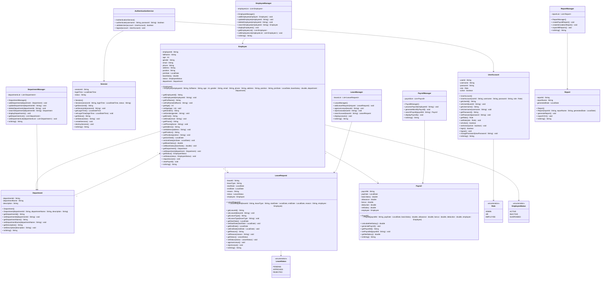

```mermaid
classDiagram

class UserAccount {
    - userId : String
    - username : String
    - password : String
    - role : Role
    - active : boolean

    + UserAccount()
    + UserAccount(userId : String, username : String, password : String, role : Role)

    + getUserId() String
    + setUserId(userId : String) void

    + getUsername() String
    + setUsername(username : String) void

    + getPassword() String
    + setPassword(password : String) void

    + getRole() Role
    + setRole(role : Role) void

    + isActive() boolean
    + setActive(active : boolean) void

    + login() boolean
    + logout() void
    + changePassword(newPassword : String) void

    + toString() String
}

class AuthenticationService {
    + AuthenticationService()

    + authenticate(username : String, password : String) boolean
    + validateUser(account : UserAccount) boolean
    + logout(account : UserAccount) void
}

class Session {
    - sessionId : String
    - loginTime : LocalDateTime
    - status : String

    + Session()
    + Session(sessionId : String, loginTime : LocalDateTime, status : String)

    + getSessionId() String
    + setSessionId(sessionId : String) void

    + getLoginTime() LocalDateTime
    + setLoginTime(loginTime : LocalDateTime) void

    + getStatus() String
    + setStatus(status : String) void

    + createSession() void
    + destroySession() void

    + toString() String
}

class Employee {
    - employeeId : String
    - fullName : String
    - age : int
    - gender : String
    - email : String
    - phone : String
    - address : String
    - position : String
    - joinDate : LocalDate
    - baseSalary : double
    - status : EmployeeStatus
    - department : Department

    + Employee()

    + Employee(employeeId : String, fullName : String, age : int, gender : String, email : String, phone : String, address : String, position : String, joinDate : LocalDate, baseSalary : double, department : Department)

    + getEmployeeId() String
    + setEmployeeId(employeeId : String) void

    + getFullName() String
    + setFullName(fullName : String) void

    + getAge() int
    + setAge(age : int) void

    + getGender() String
    + setGender(gender : String) void

    + getEmail() String
    + setEmail(email : String) void

    + getPhone() String
    + setPhone(phone : String) void

    + getAddress() String
    + setAddress(address : String) void

    + getPosition() String
    + setPosition(position : String) void

    + getJoinDate() LocalDate
    + setJoinDate(joinDate : LocalDate) void

    + getBaseSalary() double
    + setBaseSalary(baseSalary : double) void

    + getDepartment() Department
    + setDepartment(department : Department) void

    + getStatus() EmployeeStatus
    + setStatus(status : EmployeeStatus) void

    + requestLeave() void
    + viewPayroll() void

    + toString() String
}

class EmployeeManager {
    - employeeList : List~Employee~

    + EmployeeManager()

    + addEmployee(employee : Employee) void
    + updateEmployee(employeeId : String) void
    + deleteEmployee(employeeId : String) void
    + searchEmployee(employeeId : String) Employee
    + displayEmployees() void

    + getEmployeeList() List~Employee~
    + setEmployeeList(employeeList : List~Employee~) void

    + toString() String
}

class Department {
    - departmentId : String
    - departmentName : String
    - description : String

    + Department()

    + Department(departmentId : String, departmentName : String, description : String)

    + getDepartmentId() String
    + setDepartmentId(departmentId : String) void

    + getDepartmentName() String
    + setDepartmentName(departmentName : String) void

    + getDescription() String
    + setDescription(description : String) void

    + toString() String
}

class DepartmentManager {
    - departmentList : List~Department~

    + DepartmentManager()

    + addDepartment(department : Department) void
    + updateDepartment(departmentId : String) void
    + deleteDepartment(departmentId : String) void
    + searchDepartment(departmentId : String) Department
    + displayDepartments() void

    + getDepartmentList() List~Department~
    + setDepartmentList(departmentList : List~Department~) void

    + toString() String
}

class LeaveRequest {
    - leaveId : String
    - leaveType : String
    - startDate : LocalDate
    - endDate : LocalDate
    - reason : String
    - status : LeaveStatus
    - employee : Employee

    + LeaveRequest()

    + LeaveRequest(leaveId : String, leaveType : String, startDate : LocalDate, endDate : LocalDate, reason : String, employee : Employee)

    + getLeaveId() String
    + setLeaveId(leaveId : String) void

    + getLeaveType() String
    + setLeaveType(leaveType : String) void

    + getStartDate() LocalDate
    + setStartDate(startDate : LocalDate) void

    + getEndDate() LocalDate
    + setEndDate(endDate : LocalDate) void

    + getReason() String
    + setReason(reason : String) void

    + getStatus() LeaveStatus
    + setStatus(status : LeaveStatus) void

    + approveLeave() void
    + rejectLeave() void

    + toString() String
}

class LeaveManager {
    - leaveList : List~LeaveRequest~

    + LeaveManager()

    + addLeaveRequest(request : LeaveRequest) void
    + approveLeave(leaveId : String) void
    + rejectLeave(leaveId : String) void
    + searchLeave(leaveId : String) LeaveRequest
    + displayLeaves() void

    + toString() String
}

class Payroll {
    - payrollId : String
    - payDate : LocalDate
    - basicSalary : double
    - allowance : double
    - bonus : double
    - deduction : double
    - netSalary : double
    - employee : Employee

    + Payroll()

    + Payroll(payrollId : String, payDate : LocalDate, basicSalary : double, allowance : double, bonus : double, deduction : double, employee : Employee)

    + calculateNetSalary() double
    + generatePayroll() void

    + getPayrollId() String
    + setPayrollId(payrollId : String) void

    + getNetSalary() double

    + toString() String
}

class PayrollManager {
    - payrollList : List~Payroll~

    + PayrollManager()

    + processPayroll(employeeId : String) void
    + generateMonthlyPayroll() void
    + searchPayroll(payrollId : String) Payroll
    + displayPayrolls() void

    + toString() String
}

class Report {
    - reportId : String
    - reportName : String
    - generatedDate : LocalDate

    + Report()

    + Report(reportId : String, reportName : String, generatedDate : LocalDate)

    + generateReport() void
    + exportCSV() void

    + toString() String
}

class ReportManager {
    - reportList : List~Report~

    + ReportManager()

    + createPayrollReport() void
    + createSimulationReport() void
    + exportAllReports() void

    + toString() String
}

class Role {
    <<enumeration>>
    ADMIN
    HR
    EMPLOYEE
}

class EmployeeStatus {
    <<enumeration>>
    ACTIVE
    INACTIVE
    SUSPENDED
}

class LeaveStatus {
    <<enumeration>>
    PENDING
    APPROVED
    REJECTED
}

AuthenticationService --> UserAccount
AuthenticationService --> Session

UserAccount --> Role

Department "1" --> "*" Employee
Employee --> Department
Employee --> EmployeeStatus

EmployeeManager --> Employee
DepartmentManager --> Department

Employee "1" --> "*" LeaveRequest
LeaveRequest --> LeaveStatus
LeaveManager --> LeaveRequest

Employee "1" --> "*" Payroll
PayrollManager --> Payroll

ReportManager --> Report
```
