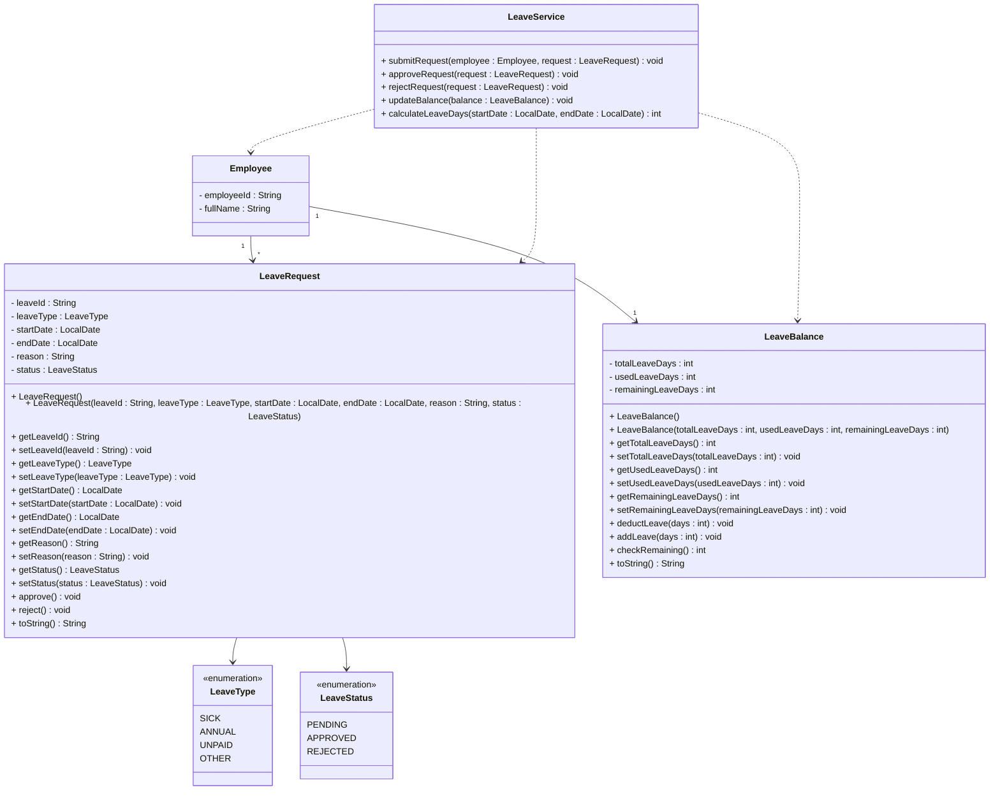

```mermaid
classDiagram

class Employee {
    - employeeId : String
    - fullName : String
}

class LeaveRequest {
    - leaveId : String
    - leaveType : LeaveType
    - startDate : LocalDate
    - endDate : LocalDate
    - reason : String
    - status : LeaveStatus

    + LeaveRequest()
    + LeaveRequest(leaveId : String, leaveType : LeaveType, startDate : LocalDate, endDate : LocalDate, reason : String, status : LeaveStatus)

    + getLeaveId() String
    + setLeaveId(leaveId : String) void

    + getLeaveType() LeaveType
    + setLeaveType(leaveType : LeaveType) void

    + getStartDate() LocalDate
    + setStartDate(startDate : LocalDate) void

    + getEndDate() LocalDate
    + setEndDate(endDate : LocalDate) void

    + getReason() String
    + setReason(reason : String) void

    + getStatus() LeaveStatus
    + setStatus(status : LeaveStatus) void

    + approve() void
    + reject() void

    + toString() String
}

class LeaveBalance {
    - totalLeaveDays : int
    - usedLeaveDays : int
    - remainingLeaveDays : int

    + LeaveBalance()
    + LeaveBalance(totalLeaveDays : int, usedLeaveDays : int, remainingLeaveDays : int)

    + getTotalLeaveDays() int
    + setTotalLeaveDays(totalLeaveDays : int) void

    + getUsedLeaveDays() int
    + setUsedLeaveDays(usedLeaveDays : int) void

    + getRemainingLeaveDays() int
    + setRemainingLeaveDays(remainingLeaveDays : int) void

    + deductLeave(days : int) void
    + addLeave(days : int) void
    + checkRemaining() int

    + toString() String
}

class LeaveService {
    + submitRequest(employee : Employee, request : LeaveRequest) void
    + approveRequest(request : LeaveRequest) void
    + rejectRequest(request : LeaveRequest) void
    + updateBalance(balance : LeaveBalance) void
    + calculateLeaveDays(startDate : LocalDate, endDate : LocalDate) int
}

class LeaveType {
    <<enumeration>>
    SICK
    ANNUAL
    UNPAID
    OTHER
}

class LeaveStatus {
    <<enumeration>>
    PENDING
    APPROVED
    REJECTED
}

Employee "1" --> "*" LeaveRequest
Employee "1" --> "1" LeaveBalance


LeaveService ..> Employee
LeaveService ..> LeaveRequest
LeaveService ..> LeaveBalance

LeaveRequest --> LeaveType
LeaveRequest --> LeaveStatus
```
