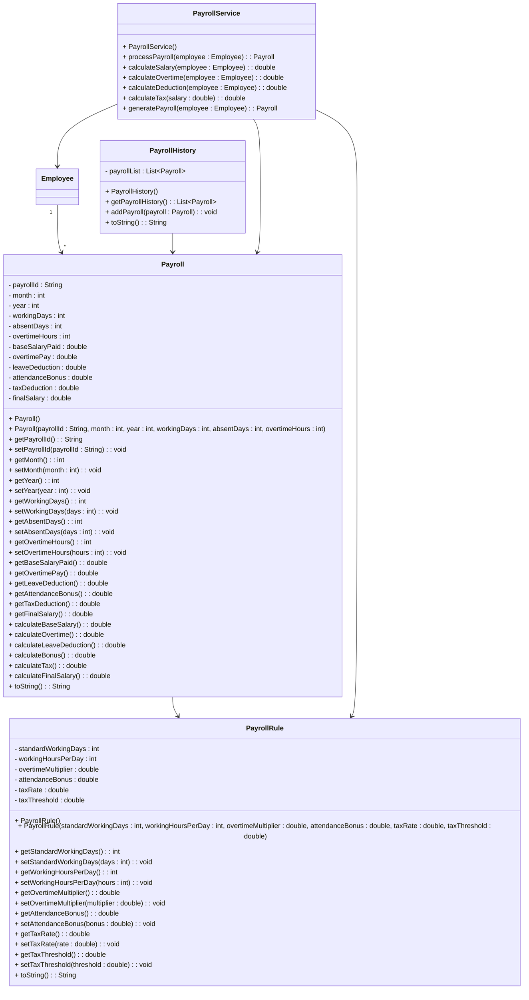

```mermaid
classDiagram

class Payroll {
    - payrollId : String
    - month : int
    - year : int
    - workingDays : int
    - absentDays : int
    - overtimeHours : int
    - baseSalaryPaid : double
    - overtimePay : double
    - leaveDeduction : double
    - attendanceBonus : double
    - taxDeduction : double
    - finalSalary : double

    + Payroll()
    + Payroll(payrollId : String, month : int, year : int, workingDays : int, absentDays : int, overtimeHours : int)

    + getPayrollId() : String
    + setPayrollId(payrollId : String) : void

    + getMonth() : int
    + setMonth(month : int) : void

    + getYear() : int
    + setYear(year : int) : void

    + getWorkingDays() : int
    + setWorkingDays(days : int) : void

    + getAbsentDays() : int
    + setAbsentDays(days : int) : void

    + getOvertimeHours() : int
    + setOvertimeHours(hours : int) : void

    + getBaseSalaryPaid() : double
    + getOvertimePay() : double
    + getLeaveDeduction() : double
    + getAttendanceBonus() : double
    + getTaxDeduction() : double
    + getFinalSalary() : double

    + calculateBaseSalary() : double
    + calculateOvertime() : double
    + calculateLeaveDeduction() : double
    + calculateBonus() : double
    + calculateTax() : double
    + calculateFinalSalary() : double

    + toString() : String
}

class PayrollRule {
    - standardWorkingDays : int
    - workingHoursPerDay : int
    - overtimeMultiplier : double
    - attendanceBonus : double
    - taxRate : double
    - taxThreshold : double

    + PayrollRule()
    + PayrollRule(standardWorkingDays : int, workingHoursPerDay : int, overtimeMultiplier : double, attendanceBonus : double, taxRate : double, taxThreshold : double)

    + getStandardWorkingDays() : int
    + setStandardWorkingDays(days : int) : void

    + getWorkingHoursPerDay() : int
    + setWorkingHoursPerDay(hours : int) : void

    + getOvertimeMultiplier() : double
    + setOvertimeMultiplier(multiplier : double) : void

    + getAttendanceBonus() : double
    + setAttendanceBonus(bonus : double) : void

    + getTaxRate() : double
    + setTaxRate(rate : double) : void

    + getTaxThreshold() : double
    + setTaxThreshold(threshold : double) : void

    + toString() : String
}

class PayrollHistory {
    - payrollList : List~Payroll~

    + PayrollHistory()

    + getPayrollHistory() : List~Payroll~
    + addPayroll(payroll : Payroll) : void

    + toString() : String
}

class PayrollService {
    + PayrollService()
    + processPayroll(employee : Employee) : Payroll
    + calculateSalary(employee : Employee) : double
    + calculateOvertime(employee : Employee) : double
    + calculateDeduction(employee : Employee) : double
    + calculateTax(salary : double) : double
    + generatePayroll(employee : Employee) : Payroll
}

Employee "1" --> "*" Payroll
Payroll --> PayrollRule
PayrollHistory --> Payroll

PayrollService --> Payroll
PayrollService --> PayrollRule
PayrollService --> Employee
```
