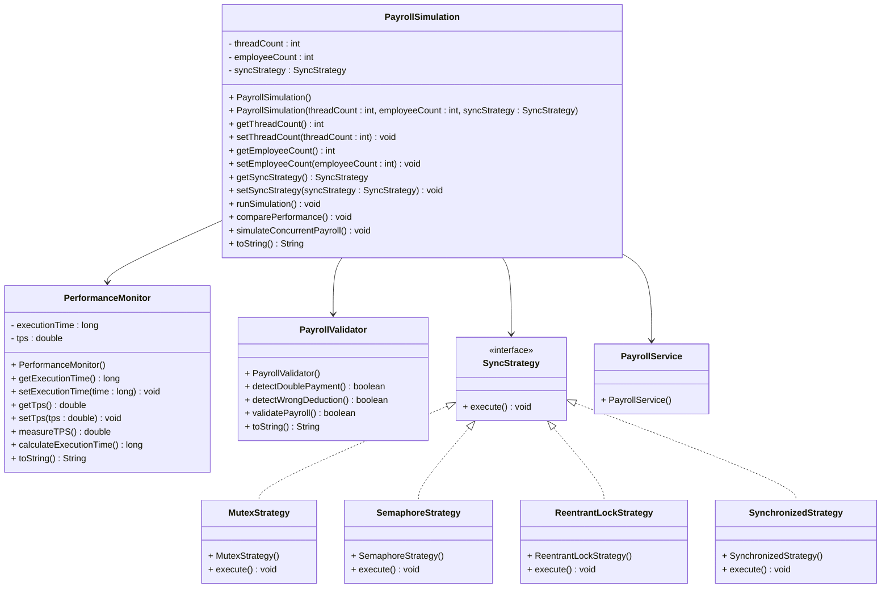

```mermaid
classDiagram

class PayrollSimulation {
    - threadCount : int
    - employeeCount : int
    - syncStrategy : SyncStrategy

    + PayrollSimulation()
    + PayrollSimulation(threadCount : int, employeeCount : int, syncStrategy : SyncStrategy)

    + getThreadCount() int
    + setThreadCount(threadCount : int) void

    + getEmployeeCount() int
    + setEmployeeCount(employeeCount : int) void

    + getSyncStrategy() SyncStrategy
    + setSyncStrategy(syncStrategy : SyncStrategy) void

    + runSimulation() void
    + comparePerformance() void
    + simulateConcurrentPayroll() void

    + toString() String
}

class PerformanceMonitor {
    - executionTime : long
    - tps : double

    + PerformanceMonitor()

    + getExecutionTime() long
    + setExecutionTime(time : long) void

    + getTps() double
    + setTps(tps : double) void

    + measureTPS() double
    + calculateExecutionTime() long

    + toString() String
}

class PayrollValidator {
    + PayrollValidator()
    + detectDoublePayment() boolean
    + detectWrongDeduction() boolean
    + validatePayroll() boolean
    + toString() String
}

class SyncStrategy {
    <<interface>>
    + execute() void
}

class MutexStrategy {
    + MutexStrategy()
    + execute() void
}

class SemaphoreStrategy {
    + SemaphoreStrategy()
    + execute() void
}

class ReentrantLockStrategy {
    + ReentrantLockStrategy()
    + execute() void
}

class SynchronizedStrategy {
    + SynchronizedStrategy()
    + execute() void
}

class PayrollService {
    + PayrollService()
}

%% Relationships
PayrollSimulation --> PayrollService
PayrollSimulation --> PerformanceMonitor
PayrollSimulation --> PayrollValidator
PayrollSimulation --> SyncStrategy

SyncStrategy <|.. MutexStrategy
SyncStrategy <|.. SemaphoreStrategy
SyncStrategy <|.. ReentrantLockStrategy
SyncStrategy <|.. SynchronizedStrategy
```
