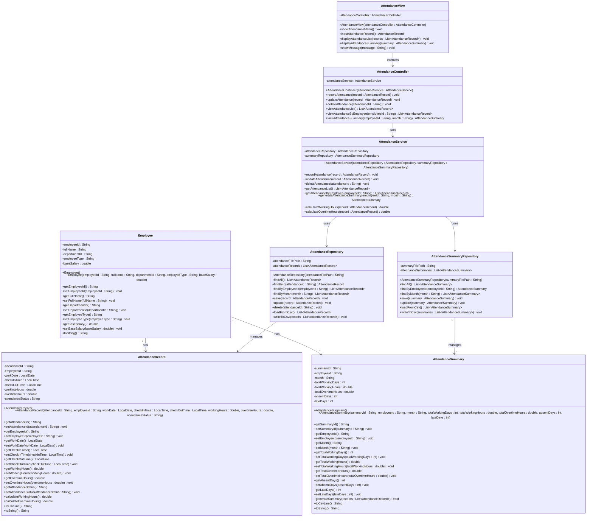

```mermaid
classDiagram

%% =========================
%% ENTITY
%% =========================

class Employee {
    -employeeId : String
    -fullName : String
    -departmentId : String
    -employeeType : String
    -baseSalary : double

    +Employee()
    +Employee(employeeId : String, fullName : String, departmentId : String, employeeType : String, baseSalary : double)
    +getEmployeeId() String
    +setEmployeeId(employeeId : String) void
    +getFullName() String
    +setFullName(fullName : String) void
    +getDepartmentId() String
    +setDepartmentId(departmentId : String) void
    +getEmployeeType() String
    +setEmployeeType(employeeType : String) void
    +getBaseSalary() double
    +setBaseSalary(baseSalary : double) void
    +toString() String
}

class AttendanceRecord {
    -attendanceId : String
    -employeeId : String
    -workDate : LocalDate
    -checkInTime : LocalTime
    -checkOutTime : LocalTime
    -workingHours : double
    -overtimeHours : double
    -attendanceStatus : String

    +AttendanceRecord()
    +AttendanceRecord(attendanceId : String, employeeId : String, workDate : LocalDate, checkInTime : LocalTime, checkOutTime : LocalTime, workingHours : double, overtimeHours : double, attendanceStatus : String)
    +getAttendanceId() String
    +setAttendanceId(attendanceId : String) void
    +getEmployeeId() String
    +setEmployeeId(employeeId : String) void
    +getWorkDate() LocalDate
    +setWorkDate(workDate : LocalDate) void
    +getCheckInTime() LocalTime
    +setCheckInTime(checkInTime : LocalTime) void
    +getCheckOutTime() LocalTime
    +setCheckOutTime(checkOutTime : LocalTime) void
    +getWorkingHours() double
    +setWorkingHours(workingHours : double) void
    +getOvertimeHours() double
    +setOvertimeHours(overtimeHours : double) void
    +getAttendanceStatus() String
    +setAttendanceStatus(attendanceStatus : String) void
    +calculateWorkingHours() double
    +calculateOvertimeHours() double
    +toCsvLine() String
    +toString() String
}

class AttendanceSummary {
    -summaryId : String
    -employeeId : String
    -month : String
    -totalWorkingDays : int
    -totalWorkingHours : double
    -totalOvertimeHours : double
    -absentDays : int
    -lateDays : int

    +AttendanceSummary()
    +AttendanceSummary(summaryId : String, employeeId : String, month : String, totalWorkingDays : int, totalWorkingHours : double, totalOvertimeHours : double, absentDays : int, lateDays : int)
    +getSummaryId() String
    +setSummaryId(summaryId : String) void
    +getEmployeeId() String
    +setEmployeeId(employeeId : String) void
    +getMonth() String
    +setMonth(month : String) void
    +getTotalWorkingDays() int
    +setTotalWorkingDays(totalWorkingDays : int) void
    +getTotalWorkingHours() double
    +setTotalWorkingHours(totalWorkingHours : double) void
    +getTotalOvertimeHours() double
    +setTotalOvertimeHours(totalOvertimeHours : double) void
    +getAbsentDays() int
    +setAbsentDays(absentDays : int) void
    +getLateDays() int
    +setLateDays(lateDays : int) void
    +generateSummary(records : List~AttendanceRecord~) void
    +toCsvLine() String
    +toString() String
}

%% =========================
%% REPOSITORY
%% =========================

class AttendanceRepository {
    -attendanceFilePath : String
    -attendanceRecords : List~AttendanceRecord~

    +AttendanceRepository(attendanceFilePath : String)
    +findAll() List~AttendanceRecord~
    +findById(attendanceId : String) AttendanceRecord
    +findByEmployeeId(employeeId : String) List~AttendanceRecord~
    +findByMonth(month : String) List~AttendanceRecord~
    +save(record : AttendanceRecord) void
    +update(record : AttendanceRecord) void
    +delete(attendanceId : String) void
    +loadFromCsv() List~AttendanceRecord~
    +writeToCsv(records : List~AttendanceRecord~) void
}

class AttendanceSummaryRepository {
    -summaryFilePath : String
    -attendanceSummaries : List~AttendanceSummary~

    +AttendanceSummaryRepository(summaryFilePath : String)
    +findAll() List~AttendanceSummary~
    +findByEmployeeId(employeeId : String) AttendanceSummary
    +findByMonth(month : String) List~AttendanceSummary~
    +save(summary : AttendanceSummary) void
    +update(summary : AttendanceSummary) void
    +loadFromCsv() List~AttendanceSummary~
    +writeToCsv(summaries : List~AttendanceSummary~) void
}

%% =========================
%% SERVICE / BUSINESS
%% =========================

class AttendanceService {
    -attendanceRepository : AttendanceRepository
    -summaryRepository : AttendanceSummaryRepository

    +AttendanceService(attendanceRepository : AttendanceRepository, summaryRepository : AttendanceSummaryRepository)
    +recordAttendance(record : AttendanceRecord) void
    +updateAttendance(record : AttendanceRecord) void
    +deleteAttendance(attendanceId : String) void
    +getAttendanceList() List~AttendanceRecord~
    +getAttendanceByEmployee(employeeId : String) List~AttendanceRecord~
    +generateAttendanceSummary(employeeId : String, month : String) AttendanceSummary
    +calculateWorkingHours(record : AttendanceRecord) double
    +calculateOvertimeHours(record : AttendanceRecord) double
}

%% =========================
%% CONTROLLER
%% =========================

class AttendanceController {
    -attendanceService : AttendanceService

    +AttendanceController(attendanceService : AttendanceService)
    +recordAttendance(record : AttendanceRecord) void
    +updateAttendance(record : AttendanceRecord) void
    +deleteAttendance(attendanceId : String) void
    +viewAttendanceList() List~AttendanceRecord~
    +viewAttendanceByEmployee(employeeId : String) List~AttendanceRecord~
    +viewAttendanceSummary(employeeId : String, month : String) AttendanceSummary
}
%% =========================
%% VIEW
%% =========================

class AttendanceView {
    -attendanceController : AttendanceController

    +AttendanceView(attendanceController : AttendanceController)
    +showAttendanceMenu() void
    +inputAttendanceRecord() AttendanceRecord
    +displayAttendanceList(records : List~AttendanceRecord~) void
    +displayAttendanceSummary(summary : AttendanceSummary) void
    +showMessage(message : String) void
}

%% =========================
%% RELATIONSHIPS
%% =========================

Employee "1" --> "*" AttendanceRecord : has
Employee "1" --> "*" AttendanceSummary : has

AttendanceRepository "1" --> "*" AttendanceRecord : manages
AttendanceSummaryRepository "1" --> "*" AttendanceSummary : manages

AttendanceService --> AttendanceRepository : uses
AttendanceService --> AttendanceSummaryRepository : uses

AttendanceController --> AttendanceService : calls
AttendanceView --> AttendanceController : interacts
```