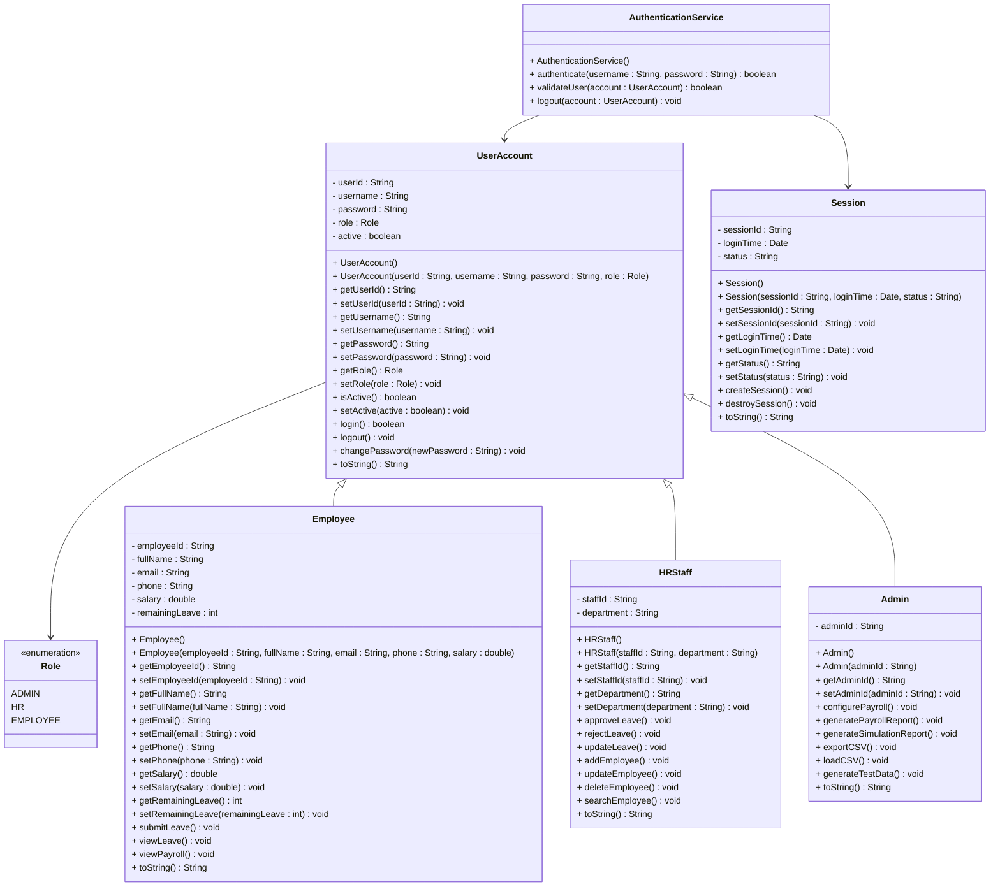

```mermaid
classDiagram

class UserAccount {
    - userId : String
    - username : String
    - password : String
    - role : Role
    - active : boolean

    + UserAccount()
    + UserAccount(userId : String, username : String, password : String, role : Role)

    + getUserId() String
    + setUserId(userId : String) void

    + getUsername() String
    + setUsername(username : String) void

    + getPassword() String
    + setPassword(password : String) void

    + getRole() Role
    + setRole(role : Role) void

    + isActive() boolean
    + setActive(active : boolean) void

    + login() boolean
    + logout() void
    + changePassword(newPassword : String) void

    + toString() String
}

class Employee {
    - employeeId : String
    - fullName : String
    - email : String
    - phone : String
    - salary : double
    - remainingLeave : int

    + Employee()

    + Employee(employeeId : String, fullName : String, email : String, phone : String, salary : double)

    + getEmployeeId() String
    + setEmployeeId(employeeId : String) void

    + getFullName() String
    + setFullName(fullName : String) void

    + getEmail() String
    + setEmail(email : String) void

    + getPhone() String
    + setPhone(phone : String) void

    + getSalary() double
    + setSalary(salary : double) void

    + getRemainingLeave() int
    + setRemainingLeave(remainingLeave : int) void

    + submitLeave() void
    + viewLeave() void
    + viewPayroll() void

    + toString() String
}

class HRStaff {
    - staffId : String
    - department : String

    + HRStaff()
    + HRStaff(staffId : String, department : String)

    + getStaffId() String
    + setStaffId(staffId : String) void

    + getDepartment() String
    + setDepartment(department : String) void

    + approveLeave() void
    + rejectLeave() void
    + updateLeave() void

    + addEmployee() void
    + updateEmployee() void
    + deleteEmployee() void
    + searchEmployee() void

    + toString() String
}

class Admin {
    - adminId : String

    + Admin()
    + Admin(adminId : String)

    + getAdminId() String
    + setAdminId(adminId : String) void

    + configurePayroll() void
    + generatePayrollReport() void
    + generateSimulationReport() void
    + exportCSV() void
    + loadCSV() void
    + generateTestData() void

    + toString() String
}

class AuthenticationService {
    + AuthenticationService()

    + authenticate(username : String, password : String) boolean
    + validateUser(account : UserAccount) boolean
    + logout(account : UserAccount) void
}

class Session {
    - sessionId : String
    - loginTime : Date
    - status : String

    + Session()
    + Session(sessionId : String, loginTime : Date, status : String)

    + getSessionId() String
    + setSessionId(sessionId : String) void

    + getLoginTime() Date
    + setLoginTime(loginTime : Date) void

    + getStatus() String
    + setStatus(status : String) void

    + createSession() void
    + destroySession() void

    + toString() String
}

class Role {
    <<enumeration>>
    ADMIN
    HR
    EMPLOYEE
}

AuthenticationService --> UserAccount
AuthenticationService --> Session

UserAccount --> Role

UserAccount <|-- Employee
UserAccount <|-- HRStaff
UserAccount <|-- Admin
```
