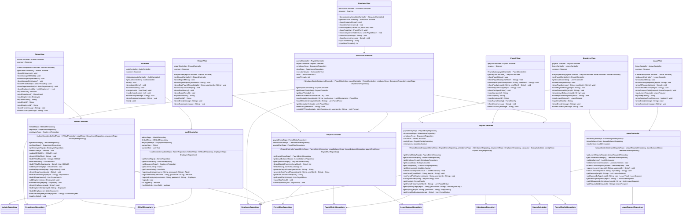

```mermaid
classDiagram
    class AuthController {
        -adminRepo : AdminRepository
        -hrStaffRepo : HRStaffRepository
        -employeeRepo : EmployeeRepository
        -currentUser : Object
        -currentRole : UserRole
        +AuthController(adminRepo : AdminRepository, hrStaffRepo : HRStaffRepository, employeeRepo : EmployeeRepository)
        +getAdminRepo() AdminRepository
        +getHrStaffRepo() HRStaffRepository
        +getEmployeeRepo() EmployeeRepository
        +getCurrentUser() Object
        +getCurrentRole() UserRole
        +loginAsAdmin(username : String, password : String) Admin
        +loginAsHRStaff(username : String, password : String) HRStaff
        +loginAsEmployee(username : String, password : String) Employee
        +logout() void
        +isLoggedIn() boolean
        +hasRole(role : UserRole) boolean
    }

    class AdminController {
        -hrStaffRepo : HRStaffRepository
        -deptRepo : DepartmentRepository
        -employeeRepo : EmployeeRepository
        +AdminController(hrStaffRepo : HRStaffRepository, deptRepo : DepartmentRepository, employeeRepo : EmployeeRepository)
        +getHrStaffRepo() HRStaffRepository
        +getDeptRepo() DepartmentRepository
        +getEmployeeRepo() EmployeeRepository
        +addHRStaff(hr : HRStaff) void
        +updateHRStaff(hr : HRStaff) void
        +deleteHRStaff(hrId : String) void
        +findHRStaffById(hrId : String) HRStaff
        +findAllHRStaff() List~HRStaff~
        +findHRStaffByDept(deptId : String) List~HRStaff~
        +addDepartment(dept : Department) void
        +updateDepartment(dept : Department) void
        +deleteDepartment(deptId : String) void
        +findDepartmentById(deptId : String) Department
        +findAllDepartments() List~Department~
        +addEmployee(emp : Employee) void
        +updateEmployee(emp : Employee) void
        +deleteEmployee(empId : String) void
        +findEmployeeById(empId : String) Employee
        +findAllEmployees() List~Employee~
        +searchEmployeeByName(keyword : String) List~Employee~
        +loadCsvData() void
    }

    class LeaveController {
        -leaveRequestRepo : LeaveRequestRepository
        -leaveBalanceRepo : LeaveBalanceRepository
        -mechanism : LockMechanism
        +LeaveController(leaveRequestRepo : LeaveRequestRepository, leaveBalanceRepo : LeaveBalanceRepository)
        +getLeaveRequestRepo() LeaveRequestRepository
        +getLeaveBalanceRepo() LeaveBalanceRepository
        +getMechanism() LockMechanism
        +setMechanism(mechanism : LockMechanism) void
        +submitLeaveRequest(request : LeaveRequest) void
        +approveLeave(requestId : String, approvedBy : String) void
        +rejectLeave(requestId : String, rejectedBy : String) void
        +getBalance(empId : String) List~LeaveBalance~
        +getBalanceByType(empId : String, type : LeaveType) LeaveBalance
        +getPendingRequests(deptId : String) List~LeaveRequest~
        +getAllRequestsByEmployee(empId : String) List~LeaveRequest~
        +getRequestById(requestId : String) LeaveRequest
    }

    class PayrollController {
        -payrollEntryRepo : PayrollEntryRepository
        -attendanceRepo : AttendanceRepository
        -employeeRepo : EmployeeRepository
        -calculator : SalaryCalculator
        -configRepo : PayrollConfigRepository
        -mechanism : LockMechanism
        +PayrollController(payrollEntryRepo : PayrollEntryRepository, attendanceRepo : AttendanceRepository, employeeRepo : EmployeeRepository, calculator : SalaryCalculator, configRepo : PayrollConfigRepository)
        +getPayrollEntryRepo() PayrollEntryRepository
        +getAttendanceRepo() AttendanceRepository
        +getEmployeeRepo() EmployeeRepository
        +getCalculator() SalaryCalculator
        +getConfigRepo() PayrollConfigRepository
        +getMechanism() LockMechanism
        +setMechanism(mechanism : LockMechanism) void
        +runPayroll(yearMonth : String, deptId : String) void
        +runPayrollForEmployee(empId : String, yearMonth : String) void
        +configureRules(config : PayrollConfig) void
        +getConfig() PayrollConfig
        +getPayrollHistory(yearMonth : String) List~PayrollEntry~
        +getPayrollByDept(deptId : String, yearMonth : String) List~PayrollEntry~
        +getPayslip(empId : String, yearMonth : String) PayrollEntry
        +getPayrollByEmployee(empId : String) List~PayrollEntry~
    }

    class SimulatorController {
        -payrollController : PayrollController
        -reportController : ReportController
        -employeeRepo : EmployeeRepository
        -deptRepo : DepartmentRepository
        -executorService : ExecutorService
        -latch : CountDownLatch
        -numThreads : int
        +SimulatorController(payrollController : PayrollController, reportController : ReportController, employeeRepo : EmployeeRepository, deptRepo : DepartmentRepository)
        +getPayrollController() PayrollController
        +getReportController() ReportController
        +getNumThreads() int
        +setNumThreads(numThreads : int) void
        +runSimulation(yearMonth : String, mechanism : LockMechanism) PayrollRun
        +runAllMechanisms(yearMonth : String) List~PayrollRun~
        +getSimulationHistory() List~PayrollRun~
        -resetData(yearMonth : String) void
        -createHRThreads(depts : List~Department~, yearMonth : String) List~Thread~
    }

    class ReportController {
        -payrollEntryRepo : PayrollEntryRepository
        -leaveBalanceRepo : LeaveBalanceRepository
        -payrollRunRepo : PayrollRunRepository
        +ReportController(payrollEntryRepo : PayrollEntryRepository, leaveBalanceRepo : LeaveBalanceRepository, payrollRunRepo : PayrollRunRepository)
        +getPayrollEntryRepo() PayrollEntryRepository
        +getLeaveBalanceRepo() LeaveBalanceRepository
        +getPayrollRunRepo() PayrollRunRepository
        +detectDoublePayments(yearMonth : String) int
        +detectWrongLeaveDeductions() int
        +generatePayrollReport(yearMonth : String) String
        +generateDeptPayrollReport(deptId : String, yearMonth : String) String
        +generateComparisonReport() String
        +getPayrollRunHistory() List~PayrollRun~
        +exportCsvResult() void
        +savePayrollRun(run : PayrollRun) void
    }

    AuthController --> AdminRepository
    AuthController --> HRStaffRepository
    AuthController --> EmployeeRepository
    AdminController --> HRStaffRepository
    AdminController --> DepartmentRepository
    AdminController --> EmployeeRepository
    LeaveController --> LeaveRequestRepository
    LeaveController --> LeaveBalanceRepository
    PayrollController --> PayrollEntryRepository
    PayrollController --> AttendanceRepository
    PayrollController --> EmployeeRepository
    PayrollController --> SalaryCalculator
    PayrollController --> PayrollConfigRepository
    SimulatorController --> PayrollController
    SimulatorController --> ReportController
    SimulatorController --> EmployeeRepository
    SimulatorController --> DepartmentRepository
    ReportController --> PayrollEntryRepository
    ReportController --> LeaveBalanceRepository
    ReportController --> PayrollRunRepository


    class MainView {
        -authController : AuthController
        -scanner : Scanner
        +MainView(authController : AuthController)
        +getAuthController() AuthController
        +start() void
        +showLoginMenu() void
        +showWelcome() void
        +navigate(role : UserRole) void
        +handleInput(choice : int) void
        +showError(message : String) void
        +showSuccess(message : String) void
        +exit() void
    }

    class AdminView {
        -adminController : AdminController
        -scanner : Scanner
        +AdminView(adminController : AdminController)
        +getAdminController() AdminController
        +showAdminMenu() void
        +showManageHRStaff() void
        +showManageDepartments() void
        +showManageEmployees() void
        +showHRStaffList(list : List~HRStaff~) void
        +showDepartmentList(list : List~Department~) void
        +showEmployeeList(list : List~Employee~) void
        +inputHRStaff() HRStaff
        +inputDepartment() Department
        +inputEmployee() Employee
        +inputHRStaffId() String
        +inputDeptId() String
        +inputEmployeeId() String
        +showError(message : String) void
        +showSuccess(message : String) void
    }

    class LeaveView {
        -leaveController : LeaveController
        -scanner : Scanner
        +LeaveView(leaveController : LeaveController)
        +getLeaveController() LeaveController
        +showLeaveMenu() void
        +showPendingRequests(deptId : String) void
        +showAllRequests(empId : String) void
        +showLeaveBalance(empId : String) void
        +showRequestDetail(request : LeaveRequest) void
        +inputLeaveRequest() LeaveRequest
        +inputRequestId() String
        +showApprovalResult(success : boolean) void
        +showError(message : String) void
        +showSuccess(message : String) void
    }

    class PayrollView {
        -payrollController : PayrollController
        -scanner : Scanner
        +PayrollView(payrollController : PayrollController)
        +getPayrollController() PayrollController
        +showPayrollMenu() void
        +showPayrollTable(yearMonth : String) void
        +showDeptPayrollTable(deptId : String, yearMonth : String) void
        +showPayslip(empId : String, yearMonth : String) void
        +showPayrollHistory(empId : String) void
        +showConfigureRules() void
        +inputYearMonth() String
        +inputDeptId() String
        +inputEmployeeId() String
        +inputPayrollConfig() PayrollConfig
        +showError(message : String) void
        +showSuccess(message : String) void
    }

    class SimulatorView {
        -simulatorController : SimulatorController
        -scanner : Scanner
        +SimulatorView(simulatorController : SimulatorController)
        +getSimulatorController() SimulatorController
        +showSimulatorMenu() void
        +showMechanismMenu() void
        +showProgress(current : int, total : int) void
        +showResult(run : PayrollRun) void
        +showComparisonTable(runs : List~PayrollRun~) void
        +showError(message : String) void
        +showSuccess(message : String) void
        +inputYearMonth() String
        +inputNumThreads() int
    }

    class ReportView {
        -reportController : ReportController
        -scanner : Scanner
        +ReportView(reportController : ReportController)
        +getReportController() ReportController
        +showReportMenu() void
        +showPayrollReport(yearMonth : String) void
        +showDeptPayrollReport(deptId : String, yearMonth : String) void
        +showComparisonReport() void
        +showRunHistory() void
        +showExportResult() void
        +inputYearMonth() String
        +inputDeptId() String
        +showError(message : String) void
        +showSuccess(message : String) void
    }

    class EmployeeView {
        -payrollController : PayrollController
        -leaveController : LeaveController
        -scanner : Scanner
        +EmployeeView(payrollController : PayrollController, leaveController : LeaveController)
        +getPayrollController() PayrollController
        +getLeaveController() LeaveController
        +showEmployeeMenu() void
        +showPayslip(empId : String, yearMonth : String) void
        +showPayrollHistory(empId : String) void
        +showPersonalInfo(empId : String) void
        +showLeaveBalance(empId : String) void
        +showMyLeaveRequests(empId : String) void
        +inputLeaveRequest() LeaveRequest
        +inputYearMonth() String
        +showError(message : String) void
        +showSuccess(message : String) void
    }

    MainView --> AuthController
    AdminView --> AdminController
    LeaveView --> LeaveController
    PayrollView --> PayrollController
    SimulatorView --> SimulatorController
    ReportView --> ReportController
    EmployeeView --> PayrollController
    EmployeeView --> LeaveController
```
