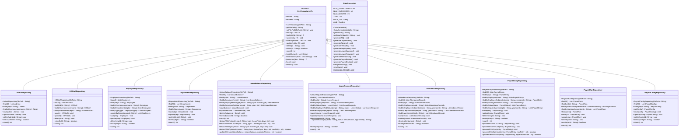

```mermaid
classDiagram
    class CsvRepository~T~ {
        <<abstract>>
        #filePath : String
        #headers : String
        +CsvRepository(filePath : String)
        +getFilePath() String
        +setFilePath(filePath : String) void
        +findAll() List~T~
        +findById(id : String) T
        +save(entity : T) void
        +saveAll(entities : List~T~) void
        +update(entity : T) void
        +delete(id : String) void
        +exists(id : String) boolean
        +count() int
        #readAllLines() List~String~
        #writeAllLines(lines : List~String~) void
        #parseLine(line : String) T
        #lock() void
        #unlock() void
    }

    class AdminRepository {
        +AdminRepository(filePath : String)
        +findAll() List~Admin~
        +findById(id : String) Admin
        +findByUsername(username : String) Admin
        +save(admin : Admin) void
        +update(admin : Admin) void
        +delete(adminId : String) void
        +exists(adminId : String) boolean
        +count() int
    }

    class HRStaffRepository {
        +HRStaffRepository(filePath : String)
        +findAll() List~HRStaff~
        +findById(id : String) HRStaff
        +findByUsername(username : String) HRStaff
        +findByDepartment(deptId : String) List~HRStaff~
        +save(hr : HRStaff) void
        +update(hr : HRStaff) void
        +delete(hrId : String) void
        +exists(hrId : String) boolean
        +count() int
    }

    class EmployeeRepository {
        +EmployeeRepository(filePath : String)
        +findAll() List~Employee~
        +findById(id : String) Employee
        +findByUsername(username : String) Employee
        +findByDepartment(deptId : String) List~Employee~
        +findByType(type : EmployeeType) List~Employee~
        +searchByName(keyword : String) List~Employee~
        +save(emp : Employee) void
        +update(emp : Employee) void
        +delete(empId : String) void
        +exists(empId : String) boolean
        +count() int
    }

    class DepartmentRepository {
        +DepartmentRepository(filePath : String)
        +findAll() List~Department~
        +findById(id : String) Department
        +findByName(name : String) Department
        +save(dept : Department) void
        +update(dept : Department) void
        +delete(deptId : String) void
        +exists(deptId : String) boolean
        +count() int
    }

    class LeaveBalanceRepository {
        +LeaveBalanceRepository(filePath : String)
        +findAll() List~LeaveBalance~
        +findById(id : String) LeaveBalance
        +findByEmployee(empId : String) List~LeaveBalance~
        +findByEmployeeAndType(empId : String, type : LeaveType) LeaveBalance
        +findByEmployeeAndYear(empId : String, year : int) List~LeaveBalance~
        +save(balance : LeaveBalance) void
        +update(balance : LeaveBalance) void
        +delete(balanceId : String) void
        +exists(balanceId : String) boolean
        +count() int
        +deductWithNoLock(empId : String, type : LeaveType, days : int) void
        +deductWithFileLock(empId : String, type : LeaveType, days : int) void
        +deductWithSync(empId : String, type : LeaveType, days : int) void
        +deductWithOptimistic(empId : String, type : LeaveType, days : int, maxRetry : int) boolean
        -updateIfVersionMatch(balance : LeaveBalance, expectedVersion : int) boolean
    }

    class LeaveRequestRepository {
        +LeaveRequestRepository(filePath : String)
        +findAll() List~LeaveRequest~
        +findById(id : String) LeaveRequest
        +findByEmployee(empId : String) List~LeaveRequest~
        +findByStatus(status : LeaveStatus) List~LeaveRequest~
        +findByEmployeeAndStatus(empId : String, status : LeaveStatus) List~LeaveRequest~
        +findPendingByDept(deptId : String) List~LeaveRequest~
        +save(request : LeaveRequest) void
        +update(request : LeaveRequest) void
        +delete(requestId : String) void
        +updateStatus(requestId : String, status : LeaveStatus, approvedBy : String) void
        +exists(requestId : String) boolean
        +count() int
    }

    class AttendanceRepository {
        +AttendanceRepository(filePath : String)
        +findAll() List~AttendanceRecord~
        +findById(id : String) AttendanceRecord
        +findByEmployee(empId : String) List~AttendanceRecord~
        +findByEmployeeAndMonth(empId : String, yearMonth : String) AttendanceRecord
        +findByDeptAndMonth(deptId : String, yearMonth : String) List~AttendanceRecord~
        +findByMonth(yearMonth : String) List~AttendanceRecord~
        +save(record : AttendanceRecord) void
        +update(record : AttendanceRecord) void
        +delete(attendanceId : String) void
        +exists(attendanceId : String) boolean
        +count() int
    }

    class PayrollEntryRepository {
        +PayrollEntryRepository(filePath : String)
        +findAll() List~PayrollEntry~
        +findById(id : String) PayrollEntry
        +findByEmployee(empId : String) List~PayrollEntry~
        +findByEmployeeAndMonth(empId : String, yearMonth : String) PayrollEntry
        +findByMonth(yearMonth : String) List~PayrollEntry~
        +findByStatus(status : PayrollStatus) List~PayrollEntry~
        +findByDeptAndMonth(deptId : String, yearMonth : String) List~PayrollEntry~
        +save(entry : PayrollEntry) void
        +update(entry : PayrollEntry) void
        +delete(entryId : String) void
        +exists(entryId : String) boolean
        +count() int
        +processWithNoLock(entry : PayrollEntry) void
        +processWithFileLock(entry : PayrollEntry) void
        +processWithSync(entry : PayrollEntry) void
        +processWithOptimistic(entry : PayrollEntry, maxRetry : int) boolean
        -updateIfVersionMatch(entry : PayrollEntry, expectedVersion : int) boolean
    }

    class PayrollRunRepository {
        +PayrollRunRepository(filePath : String)
        +findAll() List~PayrollRun~
        +findById(id : String) PayrollRun
        +findByMechanism(mechanism : LockMechanism) List~PayrollRun~
        +findByYearMonth(yearMonth : String) List~PayrollRun~
        +findLatest() PayrollRun
        +save(run : PayrollRun) void
        +update(run : PayrollRun) void
        +delete(runId : String) void
        +exists(runId : String) boolean
        +count() int
    }

    class PayrollConfigRepository {
        +PayrollConfigRepository(filePath : String)
        +findAll() List~PayrollConfig~
        +findById(id : String) PayrollConfig
        +getConfig() PayrollConfig
        +save(config : PayrollConfig) void
        +update(config : PayrollConfig) void
        +delete(configId : String) void
        +exists(configId : String) boolean
        +count() int
    }

    class DataGenerator {
        -NUM_DEPARTMENTS : int
        -NUM_EMPLOYEES : int
        -NUM_MONTHS : int
        -YEAR : int
        -DATA_DIR : String
        -rand : Random
        +DataGenerator()
        +DataGenerator(dataDir : String)
        +getDataDir() String
        +setDataDir(dataDir : String) void
        +generateAll() void
        +generateDepartments() void
        +generateAdmins() void
        +generateHRStaffs() void
        +generateEmployees() void
        +generateLeaveBalances() void
        +generateLeaveRequests() void
        +generateAttendance() void
        +generatePayrollEntries() void
        +generatePayrollConfig() void
        +verifyRoundTrip() void
        +printStats() void
        +main(args : String[]) void$
    }

    CsvRepository <|-- AdminRepository
    CsvRepository <|-- HRStaffRepository
    CsvRepository <|-- EmployeeRepository
    CsvRepository <|-- DepartmentRepository
    CsvRepository <|-- LeaveBalanceRepository
    CsvRepository <|-- LeaveRequestRepository
    CsvRepository <|-- AttendanceRepository
    CsvRepository <|-- PayrollEntryRepository
    CsvRepository <|-- PayrollRunRepository
    CsvRepository <|-- PayrollConfigRepository
```
